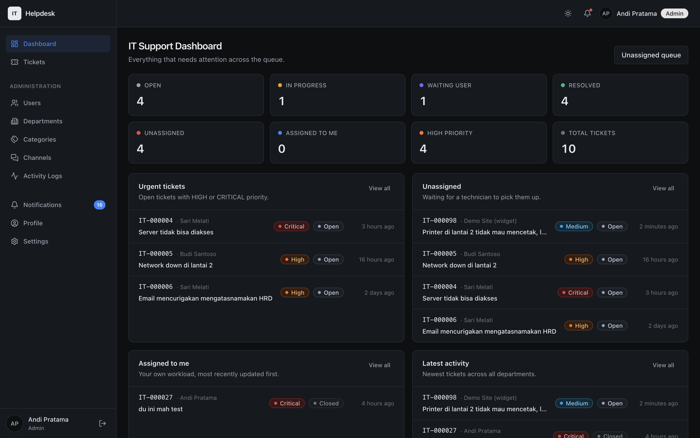
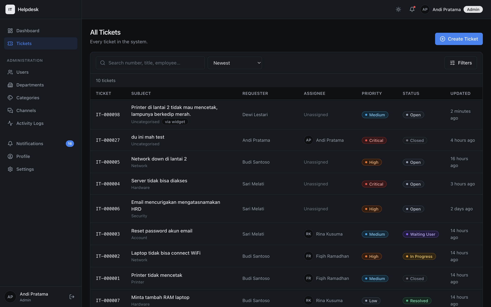
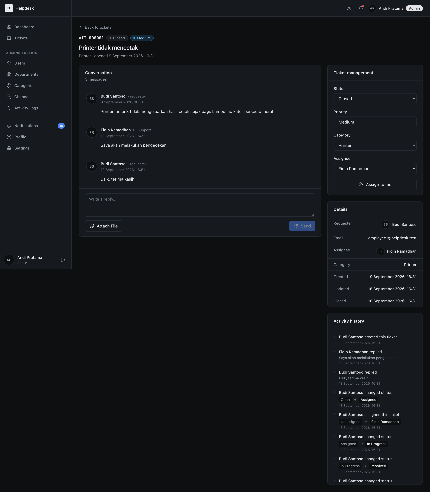
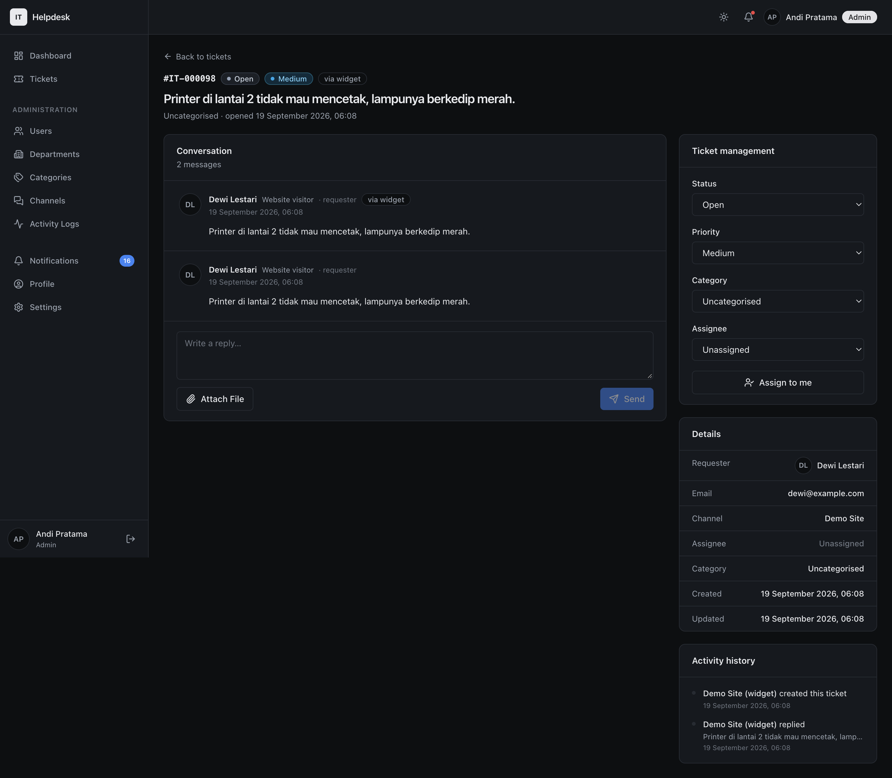
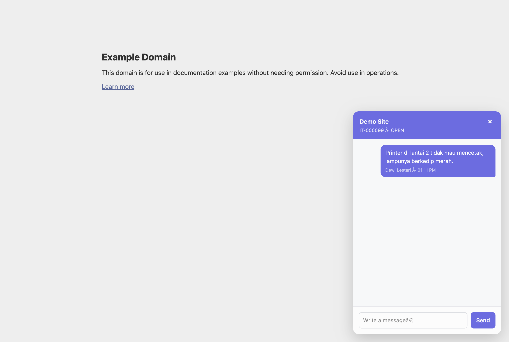
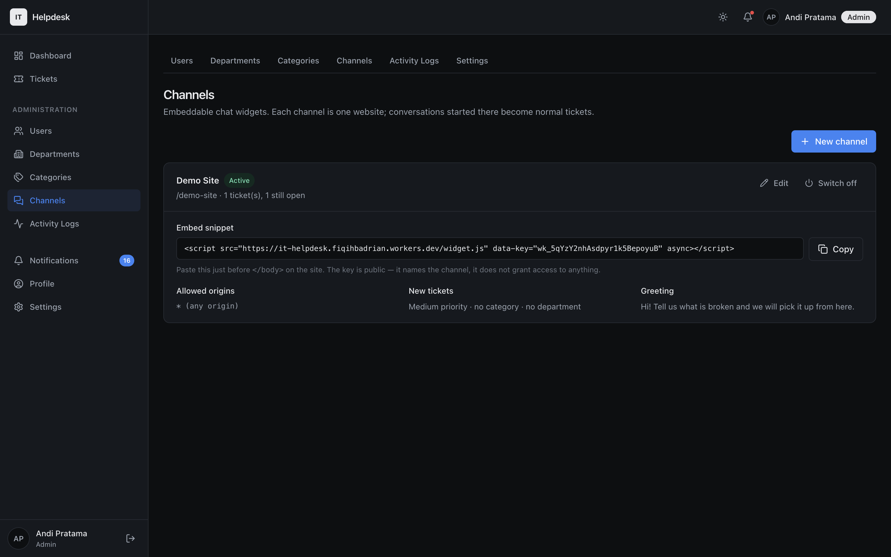
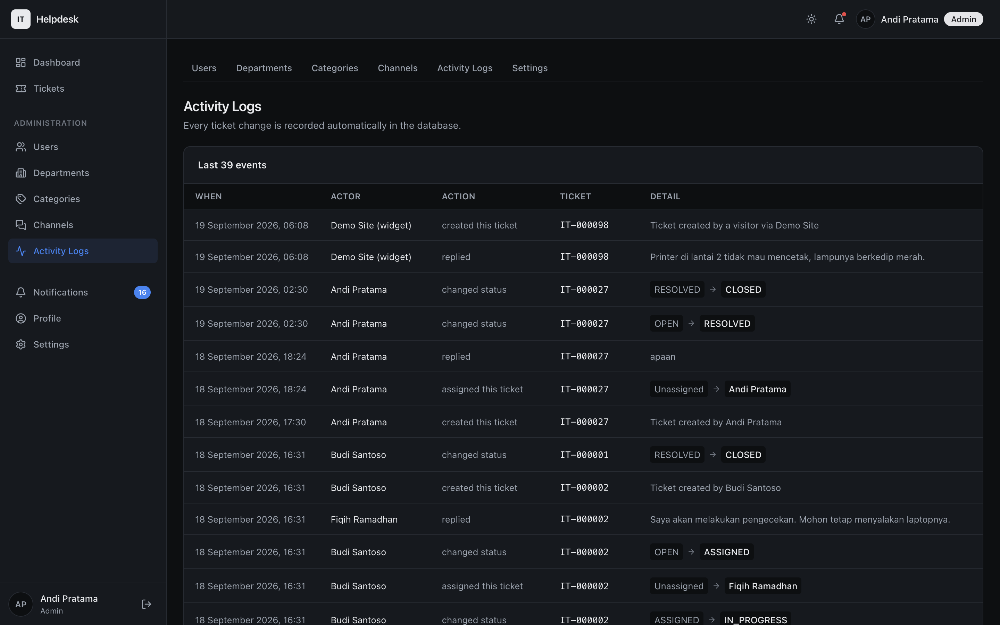
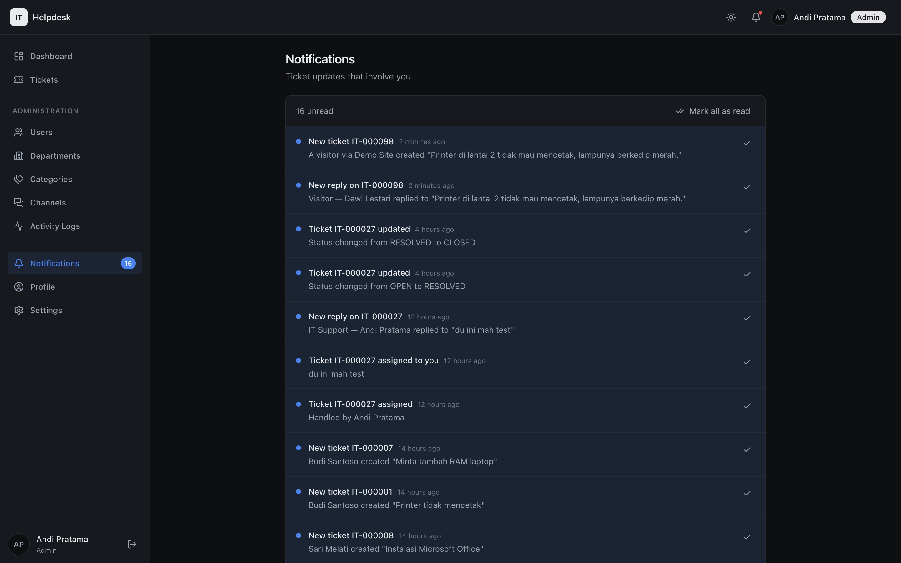
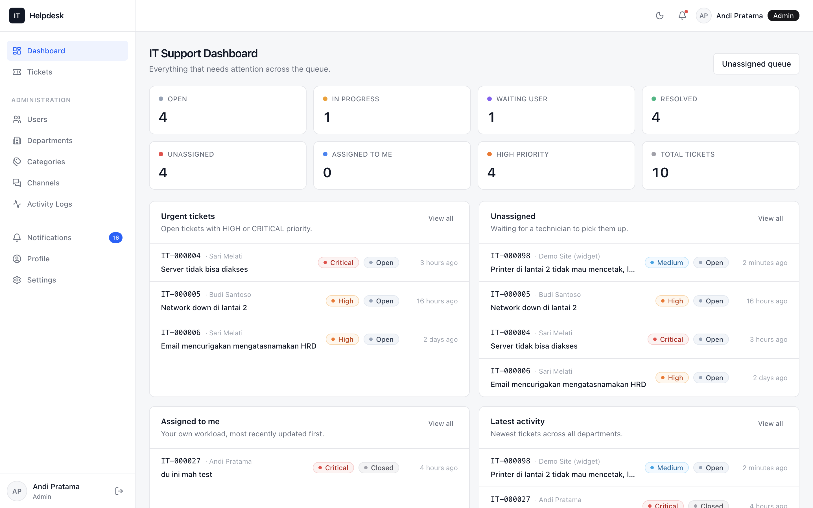

# IT Helpdesk

**An IT support ticketing system where Postgres is the authorisation layer.** The web
app, two Telegram bots, a REST API and an embeddable chat widget all act as a real
signed-in user, so every one of them is governed by the same Row Level Security
policies — there is no second permission model to keep in sync.

[](#license)
[](https://github.com/fiqihbadrian/IT-Helper/actions/workflows/ci.yml)
[](https://nextjs.org)
[](https://react.dev)
[](https://www.typescriptlang.org)
[](https://supabase.com)
[](https://workers.cloudflare.com)
[](https://ticket.fiqihbadrian.my.id)



## Table of contents

- [Live demo](#live-demo)
- [Screenshots](#screenshots)
- [Features](#features)
- [The parts worth reading](#the-parts-worth-reading)
- [Stack](#stack)
- [Quickstart](#quickstart)
- [Project layout](#project-layout)
- [Docs](#docs)
- [Roadmap](#roadmap)
- [Limitations](#limitations)
- [License](#license)

## Live demo

**<https://ticket.fiqihbadrian.my.id>**

| Email | Password | Role | What to look at |
| --- | --- | --- | --- |
| `employee1@helpdesk.test` | `Password123!` | employee | Their own tickets, the create form, the conversation timeline |

> It is a public demo on a shared database. Please do not put anything real in it —
> the data is reset whenever it gets noisy.
>
> **Only the employee login above is published.** The seeded admin and IT-support
> accounts exist, but their passwords are rotated on the deployed instance, because a
> repo anyone can read is not a place to publish an account that can delete tickets and
> deactivate users. To see the staff and admin screens, run the project locally —
> `npm run db:push` seeds all four logins with `Password123!`.

Two things you can try that most helpdesk demos do not have:

- **The embeddable widget.** Open Admin → Channels as the admin, copy the `<script>`
  snippet for `Demo Site`, and paste it into any page. A launcher appears; the
  conversation it opens becomes a real ticket in the same queue.
- **Signing in with Telegram.** The bots are live and linked to the demo accounts.
  `/auth/telegram` shows a code, one button opens the bot, and the browser signs
  itself in.

## Screenshots

| Ticket list | Ticket detail |
| --- | --- |
| [](docs/screenshots/03-tickets.png) | [](docs/screenshots/09-ticket-detail.png) |
| Status, priority and source filters | Conversation, controls and audit history on one page |

| A ticket that arrived from the widget | The same conversation, on a third-party site |
| --- | --- |
| [](docs/screenshots/10-ticket-from-widget.png) | [](docs/screenshots/13-widget-conversation.png) |
| An anonymous visitor, attributed to them | What the visitor sees |

| Admin → Channels | Activity log |
| --- | --- |
| [](docs/screenshots/05-admin-channels.png) | [](docs/screenshots/07-activity.png) |
| One channel per website, with the embed snippet | Written by database triggers, not application code |

| Notifications | Light theme |
| --- | --- |
| [](docs/screenshots/04-notifications.png) | [](docs/screenshots/11-light-theme.png) |
| In-app notification list | Dark is the default; light is one click away |

Also: [login](docs/screenshots/01-login.png) ·
[admin users](docs/screenshots/06-admin-users.png) ·
[profile](docs/screenshots/08-profile.png) ·
[widget visitor form](docs/screenshots/12-widget-visitor-form.png)

## Features

**Tickets**
: Six statuses (`OPEN`, `ASSIGNED`, `IN_PROGRESS`, `WAITING_USER`, `RESOLVED`,
`CLOSED`), four priorities, eight seeded categories, human-readable numbers
(`IT-000001`), assignee, department, and attachments in a private bucket served
through signed URLs.

**Conversation timeline**
: Comments and audit history merged into one thread. The history is written by
database triggers, so it cannot be skipped by a code path that forgets to log.

**Search, filter, sort**
: By status, priority, category, assignee, source, and free text. Scope switches
between "mine", "assigned to me" and "all".

**Three dashboards**
: An employee sees their own tickets; the bench sees the queue; admins see
everything plus the counters.

**Notifications**
: In-app, plus Telegram delivery. The audience is decided at creation time and
queued per channel in `notification_deliveries`, so a channel that is not
configured does not lose the event.

**Admin**
: Users, departments, categories, channels, and an activity log.

**REST API v1**
: Self-describing at `GET /api/v1`. Keys are prefixed `itk_…` and act as their
owner — the API is not a privileged back door.

**Embeddable widget**
: One `<script>` tag, no dependencies, renders in a shadow root, CORS-locked per
channel, rate-limited per IP.

**Dark and light**
: Dark by default, remembered per device, applied before first paint so there is
no flash.

**Two Telegram bots**
: An employee bot and an IT staff bot, with role-specific command menus, ticket
creation, replies, queue claiming, and sign-in to the web app.

## The parts worth reading

### Authorisation is one SQL file, not five

`supabase/migrations/0003_rls.sql` is the whole permission model. Everything else is
either a UI convenience or reuses it:

```ts
// lib/db/pool.ts — how the bot, the REST API and the widget all reach the database
await asUser(profileId, (db) => db.query("select * from tickets"));
//   begin;
//   set local role authenticated;
//   set local request.jwt.claims = '{"sub":"<profileId>", ...}';
//   ... your query ...
//   commit;
```

Because `auth.uid()` resolves to the impersonated profile, `tickets_select`,
`can_access_ticket()` and friends apply unchanged. An employee cannot read another
employee's ticket through the bot any more than through the browser — and a change to
a policy changes all four surfaces at once, with no deploy.

The "menu is presentation, not authorization" rule follows from the same idea: the
Telegram ☰ menus differ per bot, but staff-only commands are re-checked in
`lib/telegram/commands.ts`, and the real gate is RLS.

### Two Telegram bots, one codebase, no global

Employees talk to one bot and the bench talks to another, because a requester's update
and a queue update are different messages. Bot identity is threaded through explicitly
as `BotKind` and never parked in a module global — the webhook URL *is* the identity
(`/api/telegram/webhook` vs `/staff`), so nothing in the update payload has to say
which bot it arrived for.

### A visitor is not a user

The obvious way to build an embeddable widget is to create an account per visitor.
That is wrong: visitors have no role and no department, they would appear in
`/admin/users` and in the assignee dropdown next to real colleagues, and unlike an
employee there is nobody to ever deactivate them.

Instead each channel owns one **system profile** (`profiles.is_system`). The visitor's
words are filed as that profile; their real identity lives in `ticket_contacts`. RLS
stays untouched — `tickets_insert`'s `created_by = auth.uid()` is satisfied by the
system profile, so there is no second, weaker authorisation path to audit.

### Telegram is also a login provider

Linking a chat is enough to sign in without a password. The code alone is not a
credential for somebody else's account: the bot resolves the sender through
`telegram_links` *before* touching the code, so a stolen code only ever signs its
thief in as themselves. It is single-use, expires in 10 minutes, and is bound to an
HttpOnly cookie issued alongside it.

Because the code is never bound to a bot, the page shows one button and does not ask
which bot you linked — the bot that receives it resolves the chat across both.

### Cloudflare Workers, and one deliberate footgun avoided

The whole thing ships as a single Worker. Two details are easy to get wrong and both
are load-bearing:

- **Hyperdrive query caching must stay off.** Its cache key is the SQL text plus
  parameters, and it knows nothing about `set local role` / `request.jwt.claims`. With
  caching on, two users running the same statement would share a cache entry and read
  each other's rows.
- **`lib/db/pool.ts` has two backends behind one API.** Node keeps a shared `pg.Pool`;
  Workers open one `pg.Client` per call, because Workers forbid I/O across request
  contexts and a global pool would hand out sockets belonging to a finished request.

### Theme without a single `dark:` variant

Colours are named by role (`surface`, `ink`, `accent`, four status families) as CSS
custom properties holding RGB channels, so Tailwind's opacity modifier keeps working.
`:root` holds the dark values and `html[data-theme="light"]` overrides them. A status
picks a *tone* by name (`open`, `progress`, `critical`, …) which `app/globals.css` maps
to a palette per theme, so no component can drift out of sync. An inline script applies
the stored theme before first paint.

## Stack

| Layer | Choice |
| --- | --- |
| Framework | Next.js 15 App Router, React 19, TypeScript (strict) |
| Styling | Tailwind CSS over CSS custom properties |
| Database | Supabase Postgres, Row Level Security, `SECURITY DEFINER` triggers |
| Auth | Supabase Auth — email + password, and via Telegram |
| Files | Supabase Storage, private bucket, signed URLs |
| Bots | Telegram Bot API, webhooks |
| Hosting | Cloudflare Workers via `@opennextjs/cloudflare`, Hyperdrive |
| CI | GitHub Actions — typecheck, build, 103 database checks |

## Quickstart

```bash
npm install
cp .env.local.example .env.local     # then fill in the values
npm run db:push                      # migrations + demo data
npm run dev
```

`.env.local` needs a Supabase project URL, its publishable key, and the service-role
key (server-only). `SUPABASE_DB_URL` is only used by the CLI scripts.

No Supabase CLI and no Docker are required. Migrations are plain SQL pushed by
`scripts/db-push.mjs`, or you can paste `supabase/all_in_one_schema.sql` into the
Supabase SQL editor — that file is generated from the migrations by `npm run db:bundle`,
so it cannot lag behind them.

### Checks

```bash
npm run typecheck    # tsc --noEmit
npm run build        # next build
npm run verify       # 103 checks against the database
```

`npm run verify` is the interesting one. It runs against a real database with real
sessions and asserts the security model rather than the UI: that RLS hides other
people's tickets, that an API key cannot escalate its owner's role, that a widget
session is unreadable even for staff, that a sign-in code cannot be claimed by an
anonymous caller, and that no notification is ever addressed to a machine profile.
It needs `.env.local` and a database with the seed data.

### Optional extras

Telegram and the widget are both optional — the app runs without them.

```bash
npm run telegram:setup        https://<your-worker>.workers.dev
npm run telegram:setup:staff  https://<your-worker>.workers.dev
npm run cf:deploy             # build + deploy to Cloudflare Workers
```

## Project layout

```text
app/
  (app)/            authenticated shell: dashboard, tickets, notifications, profile, admin
  actions/          server actions (auth, tickets, notifications, admin, channels)
  api/              Telegram webhooks, REST API v1, widget API v1
components/         admin/ auth/ dashboard/ layout/ notifications/ profile/ tickets/ ui/
lib/
  supabase/         browser, server, admin (service-role) and middleware clients
  api/              REST API plumbing (auth, errors, responses, ticket queries)
  telegram/         bot plumbing (client, menus, commands, sessions, webhook, login)
  widget/           widget plumbing (keys, channels, CORS, rate limits, sessions)
  auth.ts           session + role guards
  db/pool.ts        asUser() / asSystem(), one API over Node and Workers
services/           every database query lives here, not in components
types/              domain types + generated-style database types
supabase/
  migrations/       0001 schema, 0002 triggers, 0003 RLS, 0004 storage, 0005 stats,
                    0006 API keys, 0007 Telegram, 0008 profile visibility,
                    0009 two Telegram bots, 0010 widget channels, 0011 Telegram sign-in
  seed.sql          demo departments, categories, users, tickets
public/widget.js    embeddable chat widget (vanilla, shadow DOM, no dependencies)
```

## Docs

| Guide | Covers |
| --- | --- |
| [docs/DEPLOY.md](docs/DEPLOY.md) | Cloudflare Workers, Hyperdrive, secrets, why caching is off |
| [docs/TELEGRAM.md](docs/TELEGRAM.md) | Both bots, linking, command menus, sign-in |
| [docs/API.md](docs/API.md) | REST API v1 reference |
| [docs/WIDGET.md](docs/WIDGET.md) | Channels, embed snippet, widget HTTP API |

## Roadmap

- **Phase 3 — Asset management.** A `devices` table is created and locked to admins.
  The point is to link a ticket to *the thing that is broken*.
- **Phase 4 — Remote support.** `remote_sessions` links `ticket → device → operator`.
- **A worklist built on ticket age**, so the dashboard answers "what is about to
  breach" instead of only "how many are open".

Every phase so far reused the same ticket, history and notification tables without
widening them: the widget added one column and two side tables, and the bots and the
REST API added none.

## Limitations

- Widget v1 is text-only; visitors cannot attach files.
- The widget binds one session token to exactly one ticket. "Show me all my tickets"
  for a logged-in user of a host app is a different security model and is not
  implemented.
- Telegram sign-in requires the chat to be linked already, and accounts are created by
  an admin — there is no self-registration.
- The demo channel accepts any origin on purpose, so a reviewer can paste the snippet
  anywhere. That is a demo affordance, not a production default.
- `npm run lint` is not wired up; `tsc`, `next build` and `npm run verify` are the
  checks that run.

## License

MIT — see [LICENSE](LICENSE).

```text
Copyright (c) 2026 Fiqih Badrian

Permission is hereby granted, free of charge, to any person obtaining a copy
of this software and associated documentation files (the "Software"), to deal
in the Software without restriction, including without limitation the rights
to use, copy, modify, merge, publish, distribute, sublicense, and/or sell
copies of the Software, and to permit persons to whom the Software is
furnished to do so, subject to the following conditions:

The above copyright notice and this permission notice shall be included in all
copies or substantial portions of the Software.
```

You are free to use, modify and redistribute this, including commercially. There is no
warranty. If you reuse a substantial part of it, keep the copyright notice.
